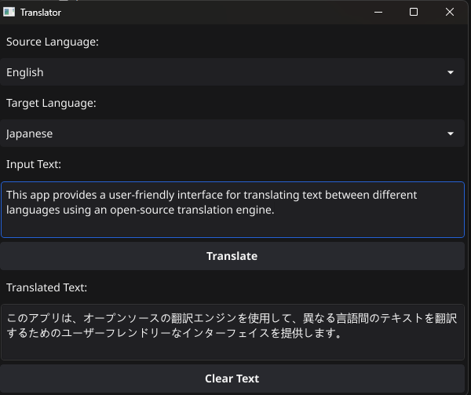

# Translator App

A simple translator application built using **Go** and **Fyne**. This app provides a user-friendly interface for translating text between different languages using an open-source translation engine.

## Features
- Translate text between multiple languages
- GUI with **Fyne**
- Text wrapping and vertical scrolling for better readability
- Support Cross-Platform(Windows, MacOS, Linux, Android, iOS,....)

## Installation

### Prerequisites
- Go **1.20+**
- Fyne **v2**

### Clone the Repository
```sh
git clone https://github.com/magdev2022/TranslatorApp.git
cd translator-app
```

### Install Dependencies
```sh
go mod tidy
```

### Run the App
```sh
go run .
```

## Credits
- [Translation API](https://github.com/OwO-Network/DeepLX)
- [Fyne](https://fyne.io/)

## Downloads(Windows, Android)

- [Translator.exe](https://mega.nz/file/HfhHyZhJ#0JcYhQhyzix_UnzIHYUGgUuGZPO8o062Es1F-oSocvg)
- [Translator.apk](https://mega.nz/file/ieYhhSKI#KYWAU0L-1qse7E4tcXODiChDZcjr0MMvf9iD3nfS8bg)

## Screenshot



